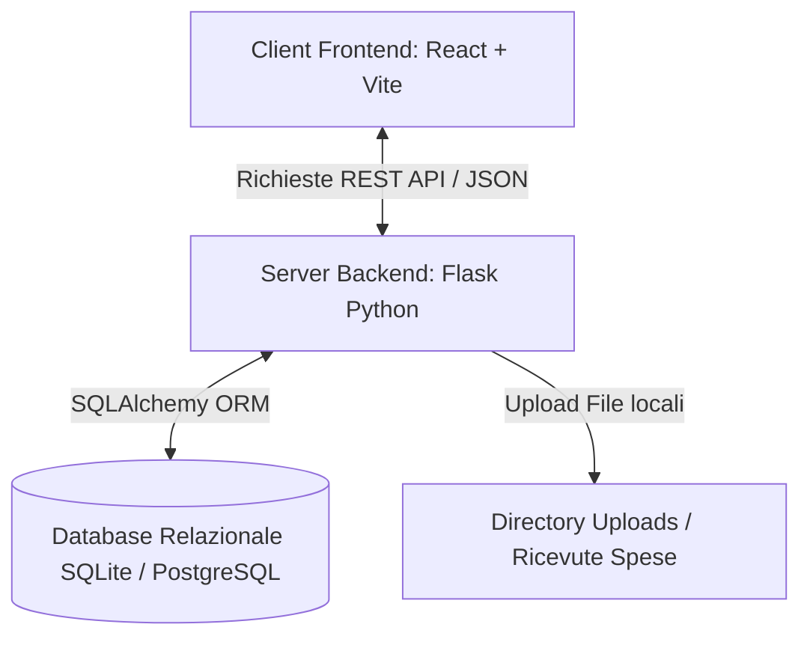
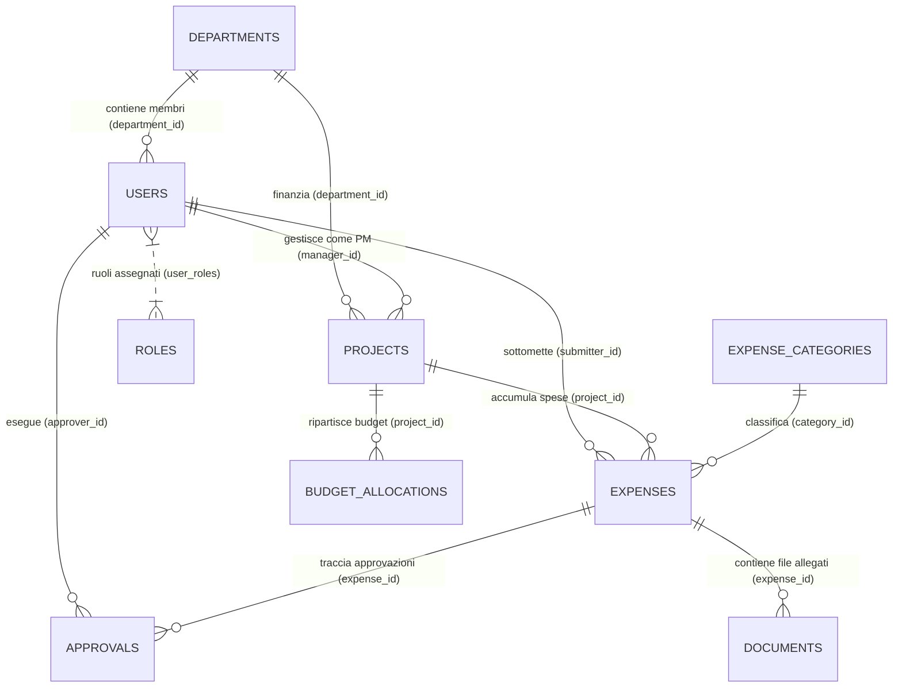
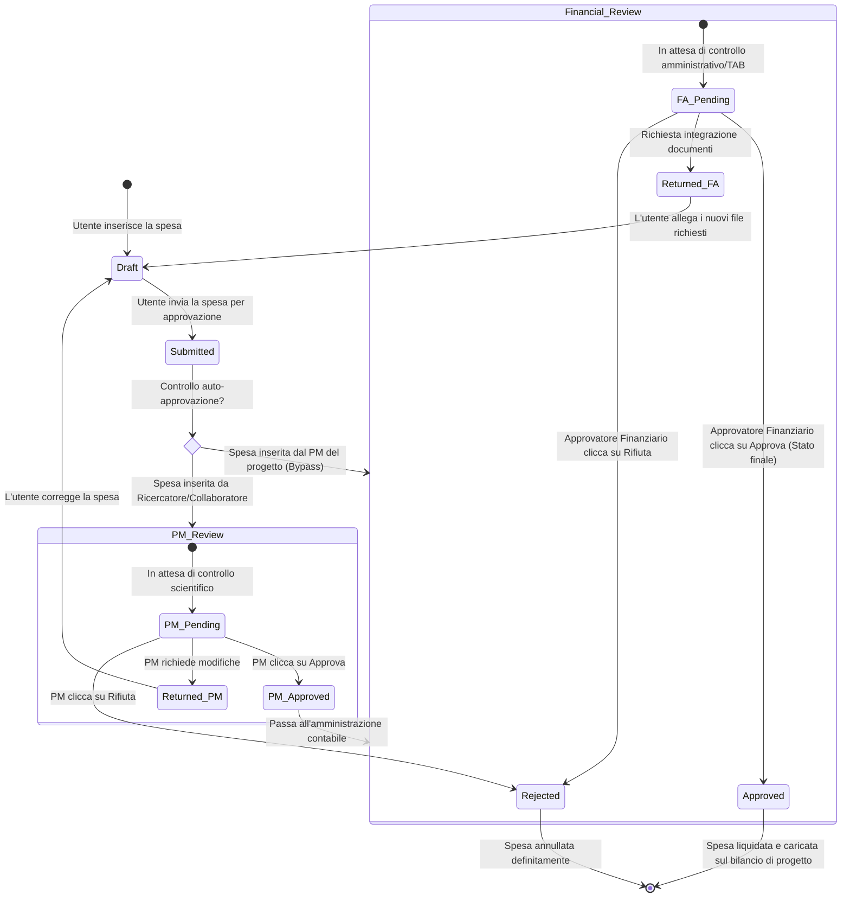

# 📘 Documentazione Completa sul Funzionamento di PoliSync AI

Benvenuto nella documentazione tecnica e funzionale dettagliata di **PoliSync AI**, la piattaforma integrata di sincronizzazione e gestione per il Politecnico di Torino. Questo documento spiega approfonditamente come funziona il programma, l'architettura dei database, come vengono gestiti gli account e la sicurezza, i ruoli utente con la relativa matrice dei permessi, e i flussi di lavoro delle note spese.

---

## 1. 🏗️ Architettura di Sistema e Flusso dei Dati

PoliSync AI è strutturato come un'applicazione web **Full-Stack disaccoppiata**:

- **Frontend (Interfaccia Utente)**: Sviluppato in **React (SPA)** con **Vite**. Gestisce la navigazione tramite `react-router-dom`, la localizzazione dinamica in due lingue (Italiano e Inglese) tramite `i18next`, la visualizzazione dei grafici tramite `Recharts` e lo stato globale tramite `Zustand`.
- **Backend (Server Logico)**: Sviluppato in **Python** utilizzando il micro-framework **Flask**. Organizzato in moduli (Blueprint) per separare le rotte API relative a utenti, progetti, dipartimenti, spese ed approvazioni.
- **Database (Persistenza)**: Mappato tramite **SQLAlchemy ORM**. In fase di sviluppo locale utilizza un database **SQLite** (`dev.db`), ma il codice è già predisposto per collegarsi a database di livello enterprise come **PostgreSQL** senza alcuna modifica strutturale.

---

## 2. 🗄️ Struttura dei Database (Schema ER e Modelli)

Il database è relazionale. Di seguito è riportato lo schema Entity-Relationship (ER) che mostra le relazioni principali:

### Tabelle del Database in Dettaglio

#### 1. `departments` (Dipartimenti)
Rappresenta i dipartimenti universitari (es. DAUIN, DET, DIMEAS, DISAT).
- `id` (Integer, Primary Key): Identificativo univoco.
- `name` (String, max 100): Nome completo del dipartimento.
- `code` (String, max 20, Unique): Sigla del dipartimento (es. "DAUIN").
- `head_id` (String UUID, Nullable, Foreign Key -> `users.id`): Identificativo del direttore di dipartimento.
- `created_at` (DateTime): Data e ora di creazione del record.

#### 2. `users` (Utenti / Personale)
Rappresenta tutti gli account registrati (amministrativi, docenti, ricercatori, ecc.).
- `id` (String UUID, Primary Key): Identificativo univoco generato automaticamente (UUIDv4).
- `email` (String, Unique, Indexed): Email dell'utente utilizzata per l'accesso (es. `nome.cognome@polito.it`).
- `password_hash` (String, max 255): Hash sicuro della password (generato tramite `bcrypt`).
- `first_name` (String, max 50): Nome dell'utente.
- `last_name` (String, max 50): Cognome dell'utente.
- `matricola` (String, Unique): Codice matricola univoco (es. "RES001", "ADM002").
- `department_id` (Integer, Foreign Key -> `departments.id`): Dipartimento di afferenza.
- `staff_type` (Enum): Ruolo accademico/contrattuale. Valori possibili:
  - `professor_ordinario` (Professore Ordinario)
  - `professor_associato` (Professore Associato)
  - `researcher` (Ricercatore RTD)
  - `phd_student` (Dottorando)
  - `post_doc` (Assegnista di Ricerca)
  - `contractor` (Collaboratore Esterno)
  - `admin_tab` (Personale Tecnico Amministrativo TAB)
- `is_active` (Boolean): Flag per abilitare/disabilitare l'account.
- `created_at` / `updated_at` (DateTime): Tracciamento temporale del record.
- `last_login` (DateTime, Nullable): Ultimo accesso effettuato dall'utente.

#### 3. `roles` (Ruoli di Sistema) & `user_roles` (Tabella di Associazione)
Modello di controllo degli accessi a molti-a-molti. Un utente può avere più ruoli contemporaneamente.
- `roles.id` (Integer, Primary Key)
- `roles.name` (String, Unique): Nome del ruolo (`ADMIN_DEPARTMENT`, `PROJECT_MANAGER`, `FINANCIAL_APPROVER`, `STANDARD_USER`).
- `roles.permissions` (JSON): Mappa di permessi booleani granulari associati al ruolo.
- `user_roles`: Tabella ponte contenente le coppie `user_id` (UUID) e `role_id` (Integer).

#### 4. `projects` (Progetti di Ricerca)
Fondi e progetti assegnati al dipartimento.
- `id` (String UUID, Primary Key)
- `name` (String, max 150): Nome completo del progetto (es. "Quantum Communication Research").
- `code` (String, Unique, Indexed): Codice identificativo del progetto (es. "POLITO-2024-QC-003").
- `description` (Text): Descrizione scientifica o tecnica del progetto.
- `department_id` (Integer, Foreign Key -> `departments.id`): Dipartimento finanziato.
- `manager_id` (String UUID, Foreign Key -> `users.id`): Project Manager responsabile del progetto.
- `total_budget` (Numeric, 12 cifre, 2 decimali): Budget totale assegnato.
- `start_date` / `end_date` (Date): Finestra temporale di validità del progetto.
- `status` (Enum): Stato attuale del progetto (`draft`, `active`, `suspended`, `closed`).
- `funding_source` (String, max 100): Ente finanziatore (es. "EU Horizon 2024").

#### 5. `expense_categories` (Categorie di Spesa)
Categorie merceologiche in cui suddividere le spese.
- `id` (Integer, Primary Key)
- `name` (String, max 50): Nome della categoria.
- `code` (String, Unique): Codice univoco (es. "TRAVEL", "EQUIPMENT", "SOFTWARE").
- `requires_approval_above` (Numeric, Nullable): Soglia monetaria oltre la quale scatta l'obbligo di controllo preventivo dettagliato.

#### 6. `expenses` (Spese)
Transazioni e richieste di rimborso sottomesse dagli utenti.
- `id` (String UUID, Primary Key)
- `title` (String, max 100): Titolo descrittivo della spesa.
- `amount` (Numeric): Importo della spesa in Euro.
- `expense_date` (Date): Data in cui è stata sostenuta la spesa.
- `category_id` (Integer, Foreign Key -> `expense_categories.id`): Categoria di spesa associata.
- `project_id` (String UUID, Foreign Key -> `projects.id`): Progetto su cui addebitare la spesa.
- `submitter_id` (String UUID, Foreign Key -> `users.id`): Utente che ha inserito la spesa.
- `status` (Enum): Stato della spesa (`draft`, `submitted`, `under_review`, `pm_approved`, `admin_approved`, `approved`, `rejected`).
- `receipt_required` (Boolean): Flag che indica se è richiesta obbligatoriamente una ricevuta.
- `is_duplicate_flagged` (Boolean): Flag automatico se il sistema rileva spese identiche per importo e data inserite dallo stesso utente (antiduplicazione).

#### 7. `approvals` (Approvazioni)
Storico delle azioni approvative e dei commenti.
- `id` (Integer, Primary Key)
- `expense_id` (String UUID, Foreign Key -> `expenses.id`)
- `approver_id` (String UUID, Foreign Key -> `users.id`): Chi ha effettuato l'azione.
- `approval_level` (Enum): Livello dell'azione (`project_manager`, `financial_admin`, `override`).
- `action` (Enum): Decisione presa (`approved`, `rejected`, `returned_for_changes`).
- `comment` (Text): Motivazione scritta del rifiuto o dell'approvazione.
- `approved_at` (DateTime): Data e ora in cui è avvenuto l'evento.

#### 8. `documents` (Allegati)
File allegati alle spese (scontrini, fatture, contratti).
- `id` (String UUID, Primary Key)
- `expense_id` (String UUID, Foreign Key -> `expenses.id`): Spesa collegata.
- `uploader_id` (String UUID, Foreign Key -> `users.id`): Utente che ha caricato il file.
- `filename` (String, max 255): Nome originale del file.
- `stored_path` (String, max 500): Percorso relativo del file salvato sul server backend (all'interno di `uploads/`).
- `file_type` (Enum): Tipo di documento (`receipt`, `invoice`, `contract`, `other`).
- `file_size` (Integer): Dimensioni del file in byte.

---

## 3. 🔐 Gestione degli Account e Sicurezza dei Dati

### Come il Database Gestisce e Collega gli Account
Ogni account utente (`users`) è identificato in modo univoco da un **UUIDv4** generato dal database. La relazione principale tra gli account e i dati è stabilita tramite chiavi esterne (`Foreign Keys`):
- Un utente fa parte di un dipartimento tramite `department_id`.
- Un progetto fa capo a un Project Manager specifico tramite `manager_id`.
- Una spesa appartiene a un utente che l'ha inserita tramite `submitter_id`.
- Un'approvazione traccia chi l'ha autorizzata tramite `approver_id`.

### Hashing e Protezione delle Password
Le password degli utenti **non vengono mai memorizzate in chiaro** nel database.
- Quando un utente si registra o un amministratore crea un nuovo profilo, la password viene convertita in un hash crittografico unidirezionale utilizzando l'algoritmo **bcrypt** integrato nella suite di sicurezza di Flask (`werkzeug.security`).
- Il database memorizza solo la stringa di hash risultante.
- Durante la procedura di accesso (Login), la password inserita dall'utente viene confrontata con l'hash memorizzato tramite la funzione `check_password_hash()`. Se l'hash corrisponde, l'utente viene autenticato.

### Autenticazione e Sessioni (JWT)
PoliSync AI utilizza un meccanismo di autenticazione stateless basato su **JWT (JSON Web Token)**:
1. **Access Token**: Un token firmato a breve scadenza (solitamente 1 ora) che viene inviato dal client nell'intestazione HTTP `Authorization: Bearer <token>` per tutte le chiamate API protette. Contiene l'identità dell'utente e i suoi ruoli.
2. **Refresh Token**: Un token a più lunga scadenza memorizzato nel browser per richiedere automaticamente un nuovo Access Token quando quest'ultimo scade, evitando di forzare l'utente a reinserire le credenziali continuamente.

### Debug & Impersonificazione (Impersonate Account)
Per scopi amministrativi e di supporto, gli utenti con ruolo `ADMIN_DEPARTMENT` dispongono della funzionalità **Impersonate**:
- Un amministratore può cliccare sul nome di un qualsiasi utente del dipartimento per "impersonarlo" temporaneamente.
- Il server emette un token JWT speciale associato all'identità dell'utente impersonato.
- Questo consente all'amministratore di vedere esattamente ciò che vede l'utente, diagnosticare problemi sulle spese o sui progetti, per poi ritornare al proprio profilo amministrativo principale con un semplice clic.

---

## 4. 👥 Ruoli Utente e Matrice dei Permessi (RBAC)

Il sistema prevede **4 ruoli principali**, ciascuno associato a una policy di permessi:

### 1. `STANDARD_USER` (Ricercatore / Dottorando / Assegnista)
*   **Chi è**: Il personale di ricerca o operativo che effettua acquisti o compie trasferte.
*   **Cosa può fare**:
    - Visualizzare il proprio cruscotto personale (spese personali, budget personali).
    - Creare, modificare ed eliminare le proprie spese in stato di *Bozza* (`draft`).
    - Inviare le spese per l'approvazione e allegarvi ricevute o fatture.
*   **Cosa NON può fare**:
    - Visualizzare le spese di altri utenti o l'andamento finanziario complessivo del dipartimento.
    - Creare o modificare progetti.
    - Approvare note spese.

### 2. `PROJECT_MANAGER` (Responsabile di Progetto / Professore)
*   **Chi è**: Il titolare del fondo di ricerca o il coordinatore scientifico di un progetto.
*   **Cosa può fare**:
    - Eseguire tutte le azioni dell'utente standard.
    - **Approvare o Rifiutare** le spese sottomesse dai collaboratori sui **progetti da lui gestiti** (Approvazione di 1° livello - scientifica).
    - Modificare i dettagli dei progetti a lui assegnati.
*   **Cosa NON può fare**:
    - Creare nuovi progetti nel sistema.
    - Gestire gli account o modificare i ruoli degli altri utenti.
    - Approvare spese su progetti di cui non è responsabile (a meno che non sia l'Admin).

### 3. `FINANCIAL_APPROVER` (Approvatore Finanziario / Ufficio Acquisti T.A.B.)
*   **Chi è**: Il personale amministrativo del dipartimento preposto alla contabilità e ai pagamenti.
*   **Cosa può fare**:
    - Eseguire tutte le azioni di inserimento spese.
    - Visualizzare **tutte** le spese e i budget del dipartimento.
    - **Eseguire l'Approvazione di 2° livello (Contabile/Finanziaria)** su tutte le spese pre-approvate dai PM per finalizzarle e autorizzare il pagamento.
    - Visualizzare le analisi finanziarie globali del dipartimento.
*   **Cosa NON può fare**:
    - Creare o modificare progetti.
    - Modificare gli utenti o i ruoli degli utenti.

### 4. `ADMIN_DEPARTMENT` (Direttore di Dipartimento / Super User)
*   **Chi è**: L'amministratore del sistema a livello di dipartimento.
*   **Cosa può fare**:
    - Gode di **accesso e controllo totale** a 360 gradi.
    - **Creare nuovi progetti** da zero e assegnare i relativi Project Manager.
    - Modificare qualsiasi progetto o utente.
    - Assegnare o cambiare i ruoli degli utenti (es. promuovere un ricercatore a PM).
    - Approvare le spese a qualsiasi livello (comprese le approvazioni di emergenza o in sostituzione del PM).
    - Utilizzare la funzione di impersonificazione per debug.

---

### Tabella Riassuntiva dei Permessi (Matrice RBAC)

| Funzionalità / Azione | `STANDARD_USER` | `PROJECT_MANAGER` | `FINANCIAL_APPROVER` | `ADMIN_DEPARTMENT` |
| :--- | :---: | :---: | :---: | :---: |
| **Inserire Spese Personali** | ✔ | ✔ | ✔ | ✔ |
| **Vedere solo le proprie Spese** | ✔ | ✔ | ✔ | ✔ |
| **Vedere TUTTE le Spese del Dipartimento** | ✘ | ✘ | ✔ | ✔ |
| **Modificare i dettagli dei Progetti assegnati** | ✘ | ✔ | ✘ | ✔ |
| **Creare Nuovi Progetti da Zero** | ✘ | ✘ | ✘ | ✔ |
| **Approvare Spese (1° livello - PM)** | ✘ | ✔ (Solo propri progetti) | ✘ | ✔ (Qualsiasi progetto) |
| **Approvare Spese (2° livello - Finanziario)** | ✘ | ✘ | ✔ | ✔ |
| **Gestire Utenti e Ruoli** | ✘ | ✘ | ✘ | ✔ |
| **Impersonare Utenti per Debug** | ✘ | ✘ | ✘ | ✔ |
| **Visualizzare Analisi Dipartimentali Globali** | ✘ | ✘ | ✔ | ✔ |

---

## 5. 🔄 Ciclo di Vita delle Spese e Flusso Approvativo

Il nucleo operativo del programma gestisce il flusso di approvazione a doppia firma, pensato per prevenire frodi o auto-approvazioni:

### Regole Speciali del Flusso:
1. **Prevenzione dell'Auto-Approvazione**: Se un Project Manager inserisce una spesa intestata a se stesso sul proprio progetto di ricerca, il sistema **impedisce** che egli possa approvarla. La spesa salta automaticamente lo stato `PM_Review` e viene instradata direttamente alla `Financial_Review` (Amministrazione contabile) per garantire la terzietà del controllo.
2. **Soglie di Spesa automatiche**: In base alla categoria di spesa, il sistema evidenzia se l'importo supera le soglie standard configurate (es. Spese di trasferta superiori a 500€), richiedendo una giustificazione supplementare.
3. **Controllo Duplicati**: Durante la sottomissione, il database scansiona le spese precedenti. Se rileva una spesa inserita dallo stesso utente, nella stessa data e con identico importo, accende un flag `is_duplicate_flagged` per avvisare gli approvatori di un potenziale inserimento doppio accidentale.

---

## 6. 📂 Sezioni del Programma e loro Integrazione

1.  **Dashboard (Pannello Principale)**: Aggrega i dati del database per mostrare le metriche chiave (budget residui dei progetti, spese in attesa di approvazione, storico spese personali).
2.  **Gestione Spese**: Si interfaccia con la tabella `expenses` e `documents`. Permette di compilare il form, scegliere la categoria e allegare una foto o PDF dello scontrino (salvato nella directory `uploads/` del backend).
3.  **Progetti**: Mostra le allocazioni finanziarie. Include grafici interattivi (ciambella e barre) per verificare quanto budget è stato speso e quanto è rimasto per ciascuna categoria merceologica.
4.  **Approvazioni**: Una inbox dedicata che mostra solo le spese che richiedono un'azione da parte dell'utente loggato (in base al suo ruolo e ai progetti associati). Registra ogni azione nella tabella `approvals`.
5.  **Analisi Dipartimento (Admin Area)**: Permette agli amministratori e approvatori di filtrare l'andamento delle spese mensili del dipartimento, visualizzare i flussi di cassa aggregati e confrontare i budget dei vari dipartimenti del Politecnico.
6.  **Gestione Utenti**: Riservata all'Admin per attivare/disattivare account e modificare l'affiliazione ai progetti.

---

## 🔑 Account e Credenziali Demo preconfigurati (per test)

Usa questi profili di prova per testare il funzionamento dei diversi ruoli e dei flussi approvativi:

| Ruolo | Email | Password | Livello di Accesso |
| :--- | :--- | :--- | :--- |
| **Amministratore (Admin)** | `admin@polito.it` | `Admin123!` | Controllo totale, creazione progetti, gestione utenti. |
| **Project Manager (PM 1)** | `pm@polito.it` | `Pm12345!` | Gestione e modifiche progetti, approvazione 1° livello. |
| **Project Manager (PM 2)** | `marco.rossi@polito.it` | `Polito2024!` | Responsabile progetti alternativi. |
| **Approvatore Finanziario** | `giulia.bianchi@polito.it` | `Polito2024!` | Controllo contabile dipartimentale, approvazione 2° livello. |
| **Ricercatore Standard** | `luca.ferrari@polito.it` | `Polito2024!` | Inserimento spese standard, visualizzazione propria area. |
| **Dottorando** | `anna.conti@polito.it` | `Polito2024!` | Inserimento spese standard sotto supervisione. |
