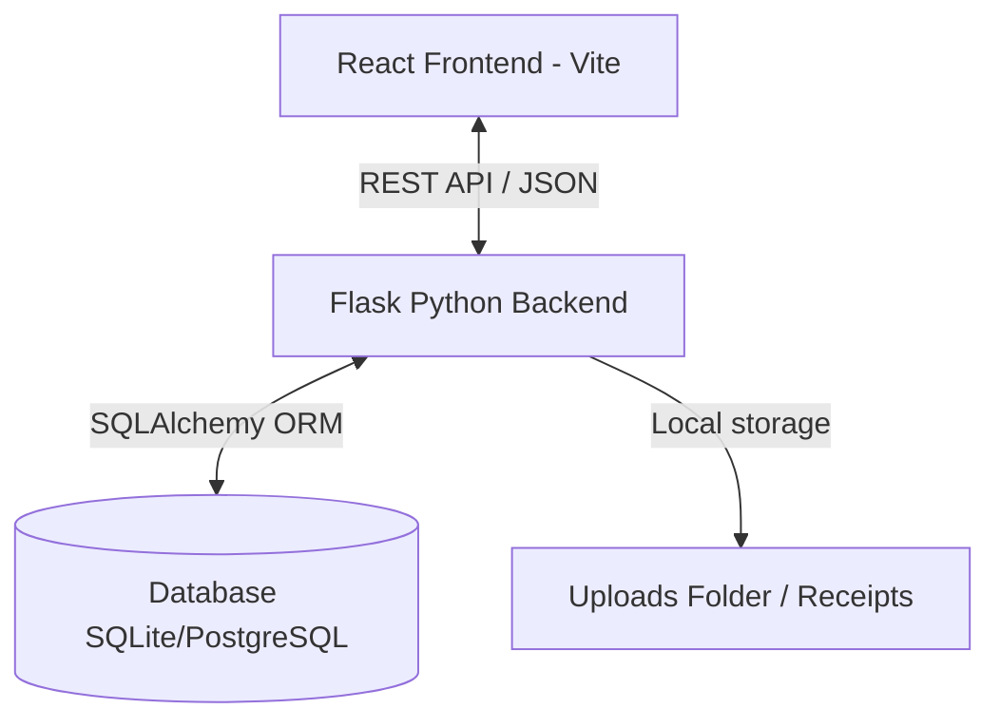
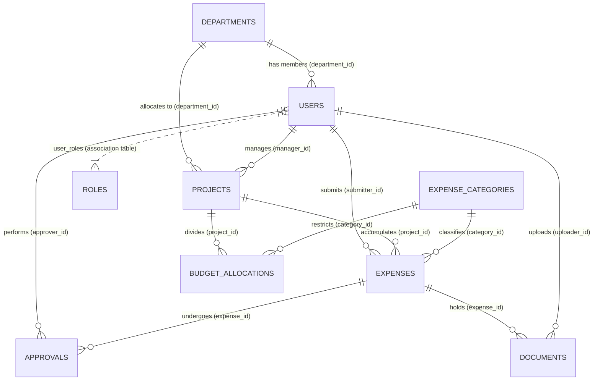
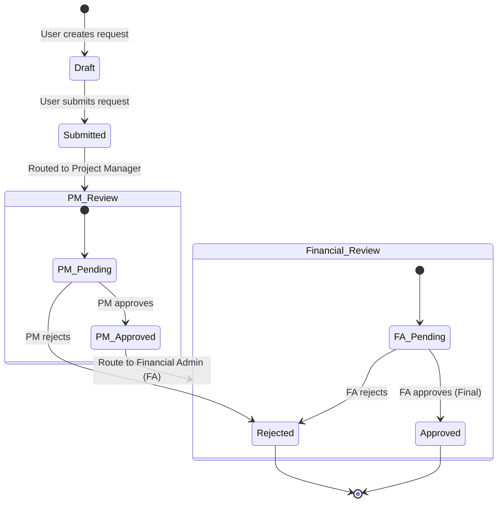

# PoliSync AI - Technical & Architectural System Report

Welcome to the comprehensive technical documentation for **PoliSync AI**, the Department Integration & Sync Platform developed for the Politecnico di Torino to streamline departmental budgets, research projects, personnel management, and expense approval workflows.

---

## 1. System Architecture Overview

PoliSync AI is structured as a decoupled full-stack web application:

- **Frontend**: A modern React Single Page Application (SPA) built using Vite. It features vanilla CSS styling, a dynamic dark-tint themed sidebar, a complete internationalization system (`i18next`) supporting English (EN) and Italian (IT), responsive layout boundaries, and data visualization powered by Recharts.
- **Backend**: A modular Python Flask application structured with blueprints, middleware, and dependency injection services.
- **Database**: Relational database schema mapped using SQLAlchemy ORM.

---

## 2. Database Schema & Data Models

Below is the Entity-Relationship Diagram (ERD) detailing the primary relationships between tables:

### Table Details & Attributes

#### 1. `departments`
Stores departmental metadata. Each department has a head/director (foreign key linking back to `users`).
- `id` (Integer, Primary Key)
- `name` (String, e.g. "Dept. of Control and Computer Engineering")
- `code` (String, Unique, e.g. "DAUIN", "DET", "DIMEAS", "DISAT")
- `head_id` (String UUID, nullable, Foreign Key -> `users.id`)
- `created_at` (DateTime)

#### 2. `users`
Represents staff and administrators.
- `id` (String UUID, Primary Key)
- `email` (String, Unique, Indexed)
- `password_hash` (String)
- `first_name` (String)
- `last_name` (String)
- `matricola` (String, Unique, e.g. "RES001")
- `department_id` (Integer, Foreign Key -> `departments.id`)
- `staff_type` (Enum: `professor_ordinario`, `professor_associato`, `researcher`, `phd_student`, `post_doc`, `contractor`, `admin_tab`)
- `is_active` (Boolean)
- `created_at` / `updated_at` (DateTime)
- `last_login` (DateTime, nullable)

#### 3. `roles` & `user_roles`
Provides access levels. `user_roles` is the junction table for the many-to-many relationship.
- `roles.id` (Integer, Primary Key)
- `roles.name` (String, Unique, e.g. `ADMIN_DEPARTMENT`, `PROJECT_MANAGER`, `FINANCIAL_APPROVER`, `STANDARD_USER`)
- `roles.permissions` (JSON, policy dictionaries)

#### 4. `projects`
Contains funding structures and project managers.
- `id` (String UUID, Primary Key)
- `name` (String, e.g. "Quantum Communication Research")
- `code` (String, Unique, Indexed, e.g. "POLITO-2024-QC-003")
- `description` (Text)
- `department_id` (Integer, Foreign Key -> `departments.id`)
- `manager_id` (String UUID, Foreign Key -> `users.id`)
- `total_budget` (Numeric/Decimal, e.g. 200000.00)
- `start_date` / `end_date` (Date)
- `status` (Enum: `draft`, `active`, `suspended`, `closed`)
- `funding_source` (String, e.g. "EU Horizon 2024")

#### 5. `expense_categories`
Predetermined buckets for expenditures.
- `id` (Integer, Primary Key)
- `name` (String, e.g. "Attrezzature / Equipment")
- `code` (String, Unique, e.g. "TRAVEL", "EQUIPMENT", "SOFTWARE", "PERSONNEL")
- `requires_approval_above` (Numeric, budget limit trigger)

#### 6. `budget_allocations`
Sub-allocations defining how much of a project's budget goes to which category.
- `id` (Integer, Primary Key)
- `project_id` (String UUID, Foreign Key -> `projects.id`)
- `category_id` (Integer, Foreign Key -> `expense_categories.id`)
- `allocated_amount` (Numeric)
- `fiscal_year` (Integer)

#### 7. `expenses`
Core transaction requests submitted by researchers.
- `id` (String UUID, Primary Key)
- `title` (String)
- `amount` (Numeric)
- `expense_date` (Date)
- `category_id` (Integer, Foreign Key -> `expense_categories.id`)
- `project_id` (String UUID, Foreign Key -> `projects.id`)
- `submitter_id` (String UUID, Foreign Key -> `users.id`)
- `status` (Enum: `draft`, `submitted`, `under_review`, `pm_approved`, `admin_approved`, `approved`, `rejected`)
- `receipt_required` (Boolean)
- `is_duplicate_flagged` (Boolean)
- `external_reference` (String, nullable)

#### 8. `approvals`
Tracks logs and comments for every step of an expense authorization workflow.
- `id` (Integer, Primary Key)
- `expense_id` (String UUID, Foreign Key -> `expenses.id`)
- `approver_id` (String UUID, Foreign Key -> `users.id`)
- `approval_level` (Enum: `project_manager`, `financial_admin`, `override`)
- `action` (Enum: `approved`, `rejected`, `returned_for_changes`)
- `comment` (Text)
- `approved_at` (DateTime)

#### 9. `documents`
Stores file attachments linked to expense receipts.
- `id` (String UUID, Primary Key)
- `expense_id` (String UUID, Foreign Key -> `expenses.id`)
- `uploader_id` (String UUID, Foreign Key -> `users.id`)
- `filename` (String)
- `stored_path` (String)
- `file_type` (Enum: `receipt`, `invoice`, `contract`, `other`)
- `file_size` (Integer)

---

## 3. User Roles & Permission Matrix

PoliSync AI implements a strict Role-Based Access Control (RBAC) model:

| Action / Capability | `STANDARD_USER` (Researcher) | `PROJECT_MANAGER` (Professors) | `FINANCIAL_APPROVER` (Admins) | `ADMIN_DEPARTMENT` (Directors) |
| :--- | :---: | :---: | :---: | :---: |
| View Personal Dashboard & Expenses | ✔ | ✔ | ✔ | ✔ |
| Create & Edit own Draft Expenses | ✔ | ✔ | ✔ | ✔ |
| Attach Receipts & Upload Invoices | ✔ | ✔ | ✔ | ✔ |
| PM-Level Approval on Assigned Projects | ✘ | ✔ | ✘ | ✔ |
| Financial-Level Approval on Department | ✘ | ✘ | ✔ | ✔ |
| Edit Projects & Manage Budgets | ✘ | ✔ (Assigned) | ✘ | ✔ (Department) |
| Impersonate Other Accounts (Debug) | ✘ | ✘ | ✘ | ✔ |
| Modify User Roles & Team Members | ✘ | ✘ | ✘ | ✔ |
| System-Wide Financial Analytics | ✘ | ✘ | ✘ | ✔ |

---

## 4. Expense Lifecycle & Approval Workflow

The diagram below details how an expense moves from a draft submission to the final payout/approval phase:

- **Double-Level Guard**: All standard project expenses require PM approval first, then Financial Approver authorization.
- **Self-Approval Prevention**: A Project Manager cannot approve their own expenses; these are automatically routed directly to the department's Financial Approvers or Department Head for review.

---

## 5. Main Sections of the Application

### 1. **Accedi (Login Page)**
- Fully expanded layout representing a premium sync gateway.
- Authenticates users using JWT tokens (access and refresh tokens).
- Integrated with language selection directly on the login header.

### 2. **Pannello Principale (Dashboard)**
- Quick statistics showing allocated budget, overall spending, remaining funds, and active tasks.
- Personal expense progress tracking for standard users.

### 3. **Gestione Spese (Expenses)**
- Advanced search and filter panel (allowing instant searches by title, status, project, and category).
- Simple expense submission form with drag-and-drop document upload.

### 4. **Progetti (Projects)**
- Overview of all research projects in the department.
- Interactive editing panels to adjust budgets, PMs, and project descriptions.
- Symmetrical layout headers with immediate access paths.

### 5. **Approvazioni (Approvals)**
- Actionable task list showing pending approvals corresponding to the user's role.
- Complete visual timeline log showing past approval actions and comments for transparent audit trails.

### 6. **Gestione e Analisi Dipartimenti (Admin Analytics)**
- Dedicated administrative overview of DAUIN, DET, DIMEAS, and DISAT.
- Interactive drill-down page for each department showing specific statistics, budget allocations, staff tables, and Recharts monthly spend timelines/category bar charts.

### 7. **Gestione Utenti (Team Settings)**
- Access list for adding, modifying, activating/deactivating users, and changing role allocations.

---

## 6. Seed Accounts & Credentials (Development)

To test the different workflow levels, the system comes populated with the following seed accounts (default password in parentheses):

- **Department Admin**: `admin@polito.it` (`Admin123!`)
- **Project Manager 1**: `pm@polito.it` (`Pm12345!`)
- **Project Manager 2**: `marco.rossi@polito.it` (`Polito2024!`)
- **Financial Approver**: `giulia.bianchi@polito.it` (`Polito2024!`)
- **Standard Researcher**: `luca.ferrari@polito.it` (`Polito2024!`)
- **PhD Student**: `anna.conti@polito.it` (`Polito2024!`)
